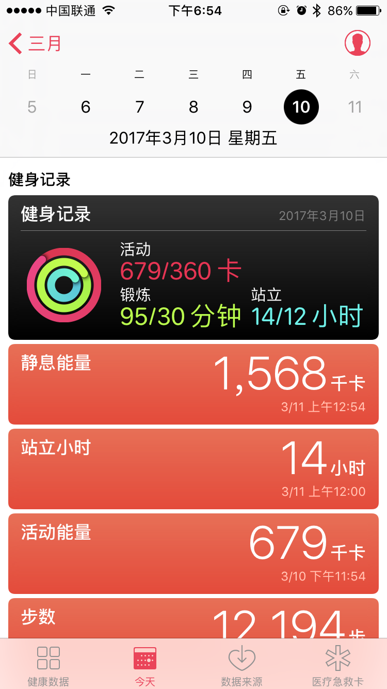
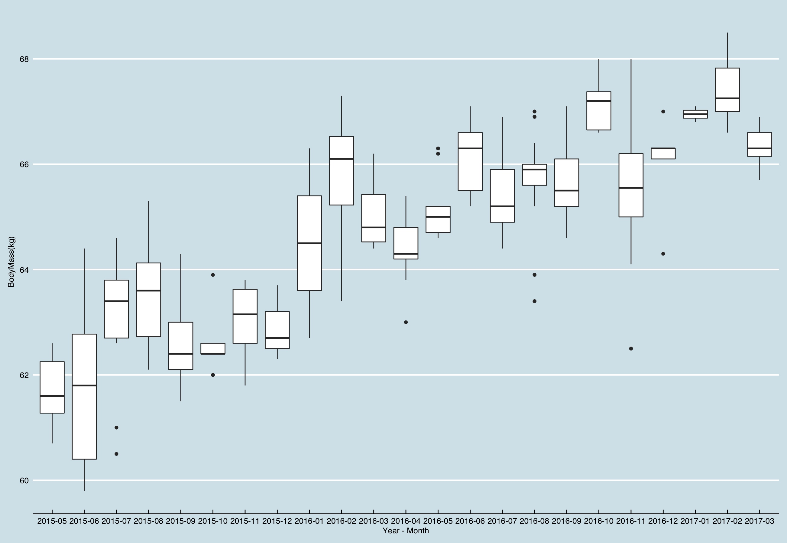
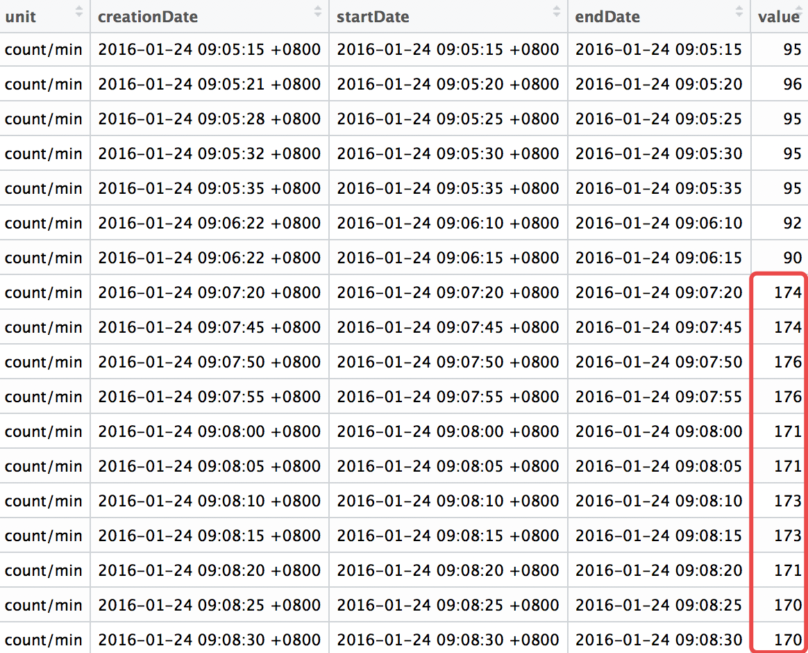
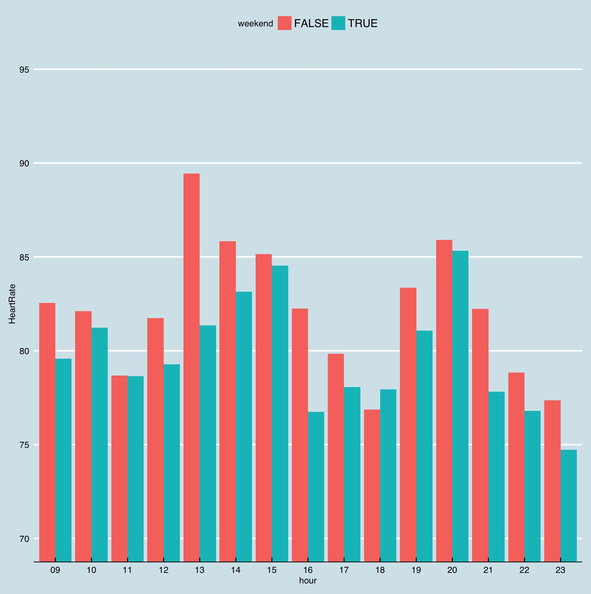
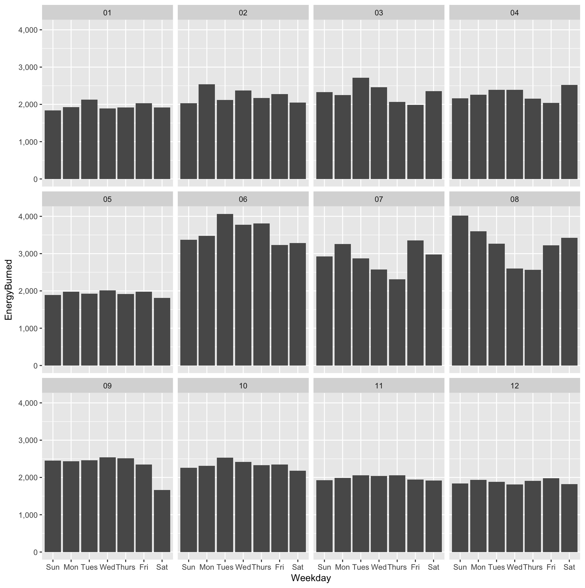

Apple Health数据分析
========================================================
***By Casper***
March 13, 2017

*目的是找出隐藏在数据中的一些规律，并且想办法进行解释。*

苹果从iOS 8就发布了Health Kit，可以让与iPhone绑定的可穿戴设备所记录的健身和体征数据综合整理在一起，让用户在iPhone上对自己的锻炼情况和健康状况有一个综合全面的了解，当时看起来苹果是很想在健康方面发力的。但是直到现在的iOS10，Health应用除了呈现每日/每周的健康数据总结之外，能够说明的健康问题实在有限，幸好苹果开放了导出功能让用户可以自己分析。



## 1. 从手机导出Apple Health数据
打开“健康”应用，在个人页面可以选择导出数据，我的iPhone记录的健康数据从2015年9月18日到2017年3月10日，时间跨度超过一年半，而且记录的体征类型也比较丰富。

```{r}
setwd("/Users/casper/百度云同步盘/Data Analysis/applehealth_data")
library(XML)
library(dplyr)
library(ggplot2)
library(ggthemes)
library(lubridate)
```

读取数据
```{r}
if (file.exists("/Users/Casper/百度云同步盘/Data Analysis/apple_health_export/data.csv")){
    df <- read.csv("/Users/Casper/百度云同步盘/Data Analysis/apple_health_export/data.csv")
} else {
    xml <- xmlParse("/Users/Casper/百度云同步盘/Data Analysis/apple_health_export/导出.xml")
    df <- XML:::xmlAttrsToDataFrame(xml["//Record"])
    write.csv(df, "/Users/Casper/百度云同步盘/Data Analysis/apple_health_export/data.csv")
}
```

## 2. 数据预处理
### 2.1 数据的结构和类型
```{r}
str(df)
```
原始数据中一共包含了九列共一百多万条健康数据!第一列是数据类型，第二和第三列是数据来源，第四列是数据单位，第五列到第七列是记录数据的时间，最后一列是设备，包含了硬件设备和健康软件。

### 2.2 健康数据类型
```{r}
unique(df$type)
```
查看一下选择体重（HKQuantityTypeIdentifierBodyMass）、卡路里消耗，包含基础代谢消耗（HKQuantityTypeIdentifierBasalEnergyBurned）和活动消耗（HKQuantityTypeIdentifierActiveEnergyBurned）以及心率（HKQuantityTypeIdentifierHeartRate）三个指标做分析。其他的数据要不就记录量不够多，要不就是与上面几个有些重复。

### 2.3 数据处理
将日期转化为时间格式，并且列出年份，月份和星期几等。
```{r}
df$value <- as.numeric(as.character(df$value))
df$endDate <- ymd_hms(df$endDate, tz="Asia/Shanghai") #tz参数一定要加上，不加上会以UTC时间计算
df$month <- format(df$endDate,"%m")
df$year <- format(df$endDate,"%Y")
df$date <- format(df$endDate,"%Y-%m-%d")
df$ym <- format(df$endDate,"%Y-%m")
df$dayofweek <- wday(df$endDate, label=TRUE, abbr=FALSE)
df$hour <- format(df$endDate,"%H")
#判断是否周末，目的是看工作日和周末生活习惯导致的体征差异
df$weekend <- lubridate::wday(df$date) %in% c(1, 7)
```

## 3. 体重数据分析
体重数据记录于小米体重秤，并通过小米健康应用同步到了Apple Health。
```{r eval=FALSE}
BodyMass <- subset(df, type == "HKQuantityTypeIdentifierBodyMass")
ggplot(BodyMass, aes(ym, value)) + 
geom_boxplot() +
theme_economist() + 
labs(x = "Year - Month", y="BodyMass(kg)")
```

从图可以看出，体重是有一定**周期性**的，冬天明显会长胖，夏秋体重有下降。跟饮食和运动的关系比较大，可以跟下面的运动数据对比分析。还有一点就是，整体趋势是波动中**上涨**的，再也回不到两年前不到60公斤的体重了。

## 4. 心率数据分析
心率数据来源于Apple Watch。
选择类型为心率的数据，在操作过程中发现，有几天在短时间之类出现了多次超过170的数据（如图），分析应该是异常数据，可能来自于软件硬件的bug。考虑到运动时的最高心率也就在140左右，决定将这些异常数据基于170进行排除。

```{r}
HeartRate <- subset(df, type == "HKQuantityTypeIdentifierHeartRate" & value < 170)
table(HeartRate$hour)
```
Apple watch晚上处于充电状态，所以记录的次数应该非常少，查看每个小时的数据计数，上午9点到晚上11点的记录数是明显高于0点到上午8点的，于是选择9点-23点区间进行分析。
```{r eval=FALSE}
HeartRate <- subset(HeartRate, hour %in% c("09", "10","11", "12", "13", "14", "15", "16", "17", "18", "19", "20",
                                           "21", "22", "23"))

HeartRate %>%
    group_by(weekend, hour) %>%
    summarize(HeartRate=mean(value)) %>%
    #print table steps by month by year
    print (n=100) %>%
    #graph data by month by year
    ggplot(aes(x=hour, y=HeartRate, fill=weekend)) + 
    geom_bar(position='dodge', stat='identity') +
    theme_economist() + 
    coord_cartesian(ylim = c(70, 95))
```


尝试了一下心率数据根月份、小时和星期数显示，发现了两个有意思的现象。第一个是，**心率按照小时显示，有两个比较明显的峰值**，最高值在分别在13点和20点，最低值分别在11点和18点。而13点和20点跟吃饭的习惯时间比较吻合。上网查了一下，饭后血液从全身向消化系统输送，这就给心脏增加了工作量，导致心率的增加，但是不知道差异这么大是不是正常。
第二个现象是，**工作日全天每个时段的心率都要高于周末**，差别最大是下午一点和四点，工作日多了10%左右。可能是工作带来的压力和用脑导致了焦虑情绪并且让心率增加。

## 5. 卡路里消耗
卡路里数据来源于iPhone和Apple Watch，也包含了一些运动健身类应用的记录。
```{r eval=FALSE}
EnergyBurned <- subset(df, type=="HKQuantityTypeIdentifierBasalEnergyBurned"|
                           type=="HKQuantityTypeIdentifierActiveEnergyBurned")

temp <- data.frame(tapply(EnergyBurned$value, EnergyBurned$date, sum))
EnergyBurned <- data.frame(Date = rownames(temp), value = temp[,])

EnergyBurned$Date <- ymd(EnergyBurned$Date)
EnergyBurned$dayofweek <- wday(EnergyBurned$Date, label = TRUE, abbr = TRUE)
rownames(EnergyBurned) <- as.vector(1:nrow(EnergyBurned))
EnergyBurned$weekend <- lubridate::wday(EnergyBurned$Date) %in% c(1, 7)
EnergyBurned$month <- format(EnergyBurned$Date,"%m")
EnergyBurned$year <- format(EnergyBurned$Date,"%Y")

y <- EnergyBurned %>%
    group_by(dayofweek, month, year) %>%
    summarize(energy=mean(value)) %>%
    print(n=133)

Energy_day_year <- data.frame(Weekday = unlist(y[1]), Month = unlist(y[2]), EnergyBurned = unlist(y[4]))

ggplot(Energy_day_year, aes(x = Weekday, y = EnergyBurned)) + 
    geom_bar(position = 'dodge', stat = 'identity') +
    scale_y_continuous(labels = scales::comma) +
    facet_wrap(~Month)
```


从月份上来看，6、7、8月的每日能量消耗是最高的，而11、12和1月的每日能量消耗最低，**季节性很分明**，跟运动习惯关系很大，我的主要运动是游泳，而6-8月夏季是游泳最频繁的时候。从星期上来看，除了8月，**周末的能量消耗都小于或者等于工作日的消耗**，暴露了宅的习惯。

## 6. 结尾
总体来看，有些有意思的发现，但是从健康角度来看，貌似都没有太多意义。
2月份的科学美国人有篇文章写过运动并不能减肥，接下来有空想分析一下，运动和体重下降的关系，毕竟运动后胃口会比较好。
虽然Apple Watch已经能记录心率、运动数据，但是因为传感器（血糖、血压、心电）的限制，这些数据能够说明的健康问题还是非常有限。**如果要用于严肃的健康服务，可穿戴式设备还有很长的路要走。**
