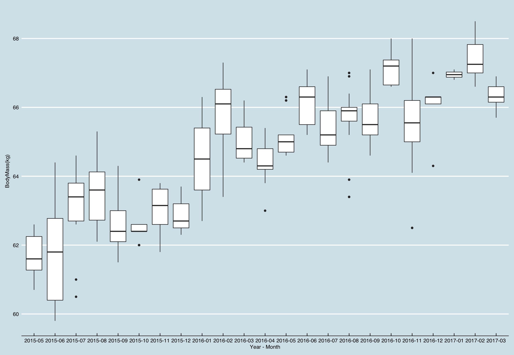
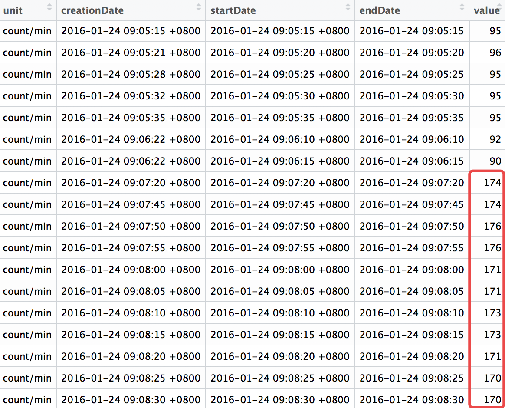

*目的是找出隐藏在数据中的一些规律，并且想办法进行解释。*

苹果从iOS 8就发布了Health
Kit，可以让与iPhone绑定的可穿戴设备所记录的健身和体征数据综合整理在一起，让用户在iPhone上对自己的锻炼情况和健康状况有一个综合全面的了解，当时看起来苹果是很想在健康方面发力的。但是直到现在的iOS10，Health应用除了呈现每日/每周的健康数据总结之外，能够说明的健康问题实在有限，幸好苹果开放了导出功能让用户可以自己分析。

1. 从手机导出Apple Health数据
-----------------------------

打开“健康”应用，在个人页面可以选择导出数据，我的iPhone记录的健康数据从2015年9月18日到2017年3月10日，时间跨度超过一年半，而且记录的体征类型也比较丰富。

    setwd("/Users/casper/百度云同步盘/Data Analysis/applehealth_data")
    library(XML)
    library(dplyr)

    ## 
    ## Attaching package: 'dplyr'

    ## The following objects are masked from 'package:stats':
    ## 
    ##     filter, lag

    ## The following objects are masked from 'package:base':
    ## 
    ##     intersect, setdiff, setequal, union

    library(ggplot2)
    library(ggthemes)
    library(lubridate)

    ## 
    ## Attaching package: 'lubridate'

    ## The following object is masked from 'package:base':
    ## 
    ##     date

读取数据

    if (file.exists("/Users/Casper/百度云同步盘/Data Analysis/apple_health_export/data.csv")){
        df <- read.csv("/Users/Casper/百度云同步盘/Data Analysis/apple_health_export/data.csv")
    } else {
        xml <- xmlParse("/Users/Casper/百度云同步盘/Data Analysis/apple_health_export/导出.xml")
        df <- XML:::xmlAttrsToDataFrame(xml["//Record"])
        write.csv(df, "/Users/Casper/百度云同步盘/Data Analysis/apple_health_export/data.csv")
    }

2. 数据预处理
-------------

### 2.1 数据的结构和类型

    str(df)

    ## 'data.frame':    1054080 obs. of  10 variables:
    ##  $ X            : int  1 2 3 4 5 6 7 8 9 10 ...
    ##  $ type         : Factor w/ 17 levels "HKCategoryTypeIdentifierAppleStandHour",..: 8 14 7 7 7 7 7 7 7 7 ...
    ##  $ sourceName   : Factor w/ 11 levels "“黄山”的 Apple Watch",..: 8 1 1 6 6 6 6 6 6 6 ...
    ##  $ sourceVersion: Factor w/ 55 levels "10.0.1","10.0.2",..: 38 NA NA 15 15 15 15 15 15 15 ...
    ##  $ unit         : Factor w/ 8 levels "cm","count","count/min",..: 2 1 5 5 5 5 5 5 5 5 ...
    ##  $ creationDate : Factor w/ 399206 levels "2015-09-17 23:06:41 +0800",..: 255910 136 136 1668 1668 1668 1668 1668 1668 16154 ...
    ##  $ startDate    : Factor w/ 692159 levels "2015-05-14 21:44:45 +0800",..: 283060 333 333 92 93 1261 1942 2571 3039 26311 ...
    ##  $ endDate      : Factor w/ 694516 levels "2015-05-14 21:44:45 +0800",..: 284844 333 333 92 93 1264 1956 2592 3059 26504 ...
    ##  $ value        : Factor w/ 61619 levels "0.000100722",..: 57101 54188 60950 60952 60930 60929 60912 60932 60932 60928 ...
    ##  $ device       : Factor w/ 256868 levels "<<HKDevice: 0x1702892e0>, name:Apple Watch, manufacturer:Apple, model:Watch, hardware:Watch1,2, software:2.0.1>",..: NA NA NA NA NA NA NA NA NA NA ...

原始数据中一共包含了九列共一百多万条健康数据!第一列是数据类型，第二和第三列是数据来源，第四列是数据单位，第五列到第七列是记录数据的时间，最后一列是设备，包含了硬件设备和健康软件。

### 2.2 健康数据类型

    unique(df$type)

    ##  [1] HKQuantityTypeIdentifierBodyMassIndex         
    ##  [2] HKQuantityTypeIdentifierHeight                
    ##  [3] HKQuantityTypeIdentifierBodyMass              
    ##  [4] HKQuantityTypeIdentifierHeartRate             
    ##  [5] HKQuantityTypeIdentifierStepCount             
    ##  [6] HKQuantityTypeIdentifierDistanceWalkingRunning
    ##  [7] HKQuantityTypeIdentifierBasalEnergyBurned     
    ##  [8] HKQuantityTypeIdentifierActiveEnergyBurned    
    ##  [9] HKQuantityTypeIdentifierFlightsClimbed        
    ## [10] HKQuantityTypeIdentifierNikeFuel              
    ## [11] HKQuantityTypeIdentifierAppleExerciseTime     
    ## [12] HKQuantityTypeIdentifierDistanceCycling       
    ## [13] HKQuantityTypeIdentifierDistanceSwimming      
    ## [14] HKQuantityTypeIdentifierSwimmingStrokeCount   
    ## [15] HKCategoryTypeIdentifierSleepAnalysis         
    ## [16] HKCategoryTypeIdentifierAppleStandHour        
    ## [17] HKCategoryTypeIdentifierMindfulSession        
    ## 17 Levels: HKCategoryTypeIdentifierAppleStandHour ...

查看一下选择体重（HKQuantityTypeIdentifierBodyMass）、卡路里消耗，包含基础代谢消耗（HKQuantityTypeIdentifierBasalEnergyBurned）和活动消耗（HKQuantityTypeIdentifierActiveEnergyBurned）以及心率（HKQuantityTypeIdentifierHeartRate）三个指标做分析。其他的数据要不就记录量不够多，要不就是与上面几个有些重复。

### 2.3 数据处理

将日期转化为时间格式，并且列出年份，月份和星期几等。

    df$value <- as.numeric(as.character(df$value))

    ## Warning: 强制改变过程中产生了NA

    df$endDate <- ymd_hms(df$endDate, tz="Asia/Shanghai") #tz参数一定要加上，不加上会以UTC时间计算

    ## Date in ISO8601 format; converting timezone from UTC to "Asia/Shanghai".

    df$month <- format(df$endDate,"%m")
    df$year <- format(df$endDate,"%Y")
    df$date <- format(df$endDate,"%Y-%m-%d")
    df$ym <- format(df$endDate,"%Y-%m")
    df$dayofweek <- wday(df$endDate, label=TRUE, abbr=FALSE)
    df$hour <- format(df$endDate,"%H")
    #判断是否周末，目的是看工作日和周末生活习惯导致的体征差异
    df$weekend <- lubridate::wday(df$date) %in% c(1, 7)

3. 体重数据分析
---------------

体重数据记录于小米体重秤，并通过小米健康应用同步到了Apple Health。

    BodyMass <- subset(df, type == "HKQuantityTypeIdentifierBodyMass")
    ggplot(BodyMass, aes(ym, value)) + 
    geom_boxplot() +
    theme_economist() + 
    labs(x = "Year - Month", y="BodyMass(kg)")

从图可以看出，体重是有一定**周期性**的，冬天明显会长胖，夏秋体重有下降。跟饮食和运动的关系比较大，可以跟下面的运动数据对比分析。还有一点就是，整体趋势是波动中**上涨**的，再也回不到两年前不到60公斤的体重了。

4. 心率数据分析
---------------

心率数据来源于Apple Watch。
选择类型为心率的数据，在操作过程中发现，有几天在短时间之类出现了多次超过170的数据（如图），分析应该是异常数据，可能来自于软件硬件的bug。考虑到运动时的最高心率也就在140左右，决定将这些异常数据基于170进行排除。

    HeartRate <- subset(df, type == "HKQuantityTypeIdentifierHeartRate" & value < 170)
    table(HeartRate$hour)

    ## 
    ##   00   01   02   03   04   05   06   07   08   09   10   11   12   13   14 
    ##  394  216  156  121  102   91   88  140  332 1312 3469 3736 3909 4281 4091 
    ##   15   16   17   18   19   20   21   22   23 
    ## 4337 4508 4380 4205 4826 4680 3932 3022 1552

Apple
watch晚上处于充电状态，所以记录的次数应该非常少，查看每个小时的数据计数，上午9点到晚上11点的记录数是明显高于0点到上午8点的，于是选择9点-23点区间进行分析。

    HeartRate <- subset(HeartRate, hour %in% c("09", "10","11", "12", "13", "14", "15", "16", "17", "18", "19", "20",
                                               "21", "22", "23"))

    HeartRate %>%
        group_by(weekend, hour) %>%
        summarize(HeartRate=mean(value)) %>%
        #print table steps by month by year
        print (n=100) %>%
        #graph data by month by year
        ggplot(aes(x=hour, y=HeartRate, fill=weekend)) + 
        geom_bar(position='dodge', stat='identity') +
        theme_economist() + 
        coord_cartesian(ylim = c(70, 95))

尝试了一下心率数据根月份、小时和星期数显示，发现了两个有意思的现象。第一个是，**心率按照小时显示，有两个比较明显的峰值**，最高值在分别在13点和20点，最低值分别在11点和18点。而13点和20点跟吃饭的习惯时间比较吻合。上网查了一下，饭后血液从全身向消化系统输送，这就给心脏增加了工作量，导致心率的增加，但是不知道差异这么大是不是正常。
第二个现象是，**工作日全天每个时段的心率都要高于周末**，差别最大是下午一点和四点，工作日多了10%左右。可能是工作带来的压力和用脑导致了焦虑情绪并且让心率增加。

5. 卡路里消耗
-------------

卡路里数据来源于iPhone和Apple Watch，也包含了一些运动健身类应用的记录。

    EnergyBurned <- subset(df, type=="HKQuantityTypeIdentifierBasalEnergyBurned"|
                               type=="HKQuantityTypeIdentifierActiveEnergyBurned")

    temp <- data.frame(tapply(EnergyBurned$value, EnergyBurned$date, sum))
    EnergyBurned <- data.frame(Date = rownames(temp), value = temp[,])

    EnergyBurned$Date <- ymd(EnergyBurned$Date)
    EnergyBurned$dayofweek <- wday(EnergyBurned$Date, label = TRUE, abbr = TRUE)
    rownames(EnergyBurned) <- as.vector(1:nrow(EnergyBurned))
    EnergyBurned$weekend <- lubridate::wday(EnergyBurned$Date) %in% c(1, 7)
    EnergyBurned$month <- format(EnergyBurned$Date,"%m")
    EnergyBurned$year <- format(EnergyBurned$Date,"%Y")

    y <- EnergyBurned %>%
        group_by(dayofweek, month, year) %>%
        summarize(energy=mean(value)) %>%
        print(n=133)

    Energy_day_year <- data.frame(Weekday = unlist(y[1]), Month = unlist(y[2]), EnergyBurned = unlist(y[4]))

    ggplot(Energy_day_year, aes(x = Weekday, y = EnergyBurned)) + 
        geom_bar(position = 'dodge', stat = 'identity') +
        scale_y_continuous(labels = scales::comma) +
        facet_wrap(~Month)

从月份上来看，6、7、8月的每日能量消耗是最高的，而11、12和1月的每日能量消耗最低，**季节性很分明**，跟运动习惯关系很大，我的主要运动是游泳，而6-8月夏季是游泳最频繁的时候。从星期上来看，除了8月，**周末的能量消耗都小于或者等于工作日的消耗**，暴露了宅的习惯。

6. 结尾
-------

总体来看，有些有意思的发现，但是从健康角度来看，貌似都没有太多意义。
2月份的科学美国人有篇文章写过运动并不能减肥，接下来有空想分析一下，运动和体重下降的关系，毕竟运动后胃口会比较好。
虽然Apple
Watch已经能记录心率、运动数据，但是因为传感器（血糖、血压、心电）的限制，这些数据能够说明的健康问题还是非常有限。**如果要用于严肃的健康服务，可穿戴式设备还有很长的路要走。**
